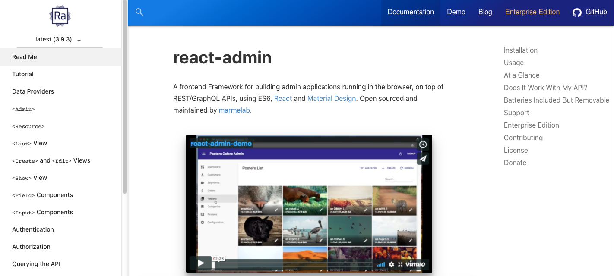
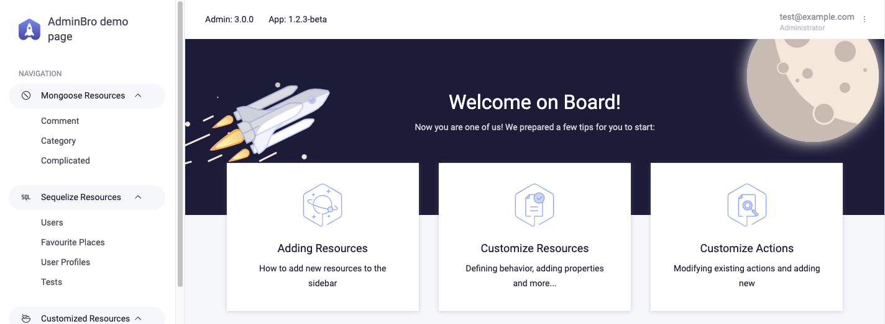
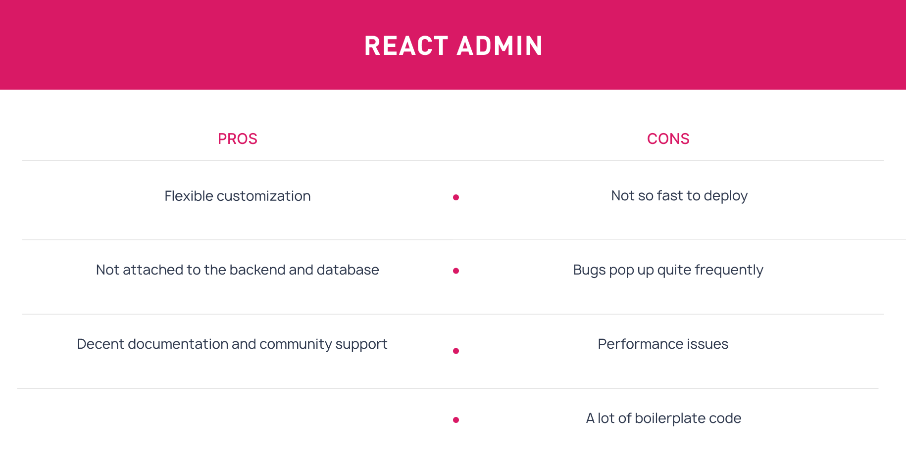

[Original on brocoders.com](https://brocoders.com/blog/administration_panels_comparison)

When it comes to web application development, many companies tend to concentrate on the functionality and design part from the end-customer perspective, while an admin panel is far too often left without due care and attention.

More often than not, developers do not consider the time needed to plan, design, and customize an **admin panel**, which might take up to 100-200 hours. This, in turn, may result in a project's delay and lead to additional expenses.

In fact, having a well-built admin panel that is fully tailored to your company's requirements is as vital as having a feature-rich and client-oriented app.

Backed by a future-proof admin panel, you can acquire in-depth insights into your business or users' behavior, as well as make invaluable data-driven decisions, thus boosting your profits. Otherwise, you may lack the insight into your data, which by itself can cause additional restraints for the entire team.

That said, it's of critical importance to understand what practices for creating admin panels can fit your specific business needs best. In this article, we'd like to share our knowledge and conduct comparative research on the solutions that we stick to when developing admin panels for our projects.

Let's get started.
## What are the essential features any decent admin panel should have?
To start with the basics, an admin panel (or administrative panel) is a separate interface in an application designed for handling various data.

Your operation and testing teams will find an admin panel very useful for verifying data and handling CRUD (Create, Read, Update and Delete) operations.

Apart from the day-to-day operations, such as viewing and editing profiles, a well-established admin panel can be turned into a dashboard to display graphics and charts. In other words, it can provide statistical business metrics and analytical reports.
That said, having a **business-oriented admin panel** is a silver bullet for your experts when it comes to managing and supervising numerous intra-company processes.

Yet, the first and foremost rule you have to remember all the time is that your admin panel must be fully tailored to your specific business needs.

Since there is no complete or comprehensive list of functionality features that must be implemented into a basic admin panel version, you have to decide which ones to opt for based on your particular project requirements.

There's a bunch of industry-specific features that you would like to add to your list, but as we see from practice, there's a minimum set of functions you'll need to work with your business data. They usually cover the following sectors:

- User management tools (like adding, deleting, creating groups, enabling/disabling user privileges, editing staff profiles, etc.)
- Content management tools (CRUD operations, full-featured inbox, data tables, search forms and results)
- Export/import of data (integration with other platforms and systems)
- Optional: detailed analytics and reports, widgets, customizable UI components, multi-purpose templates and multi-level menu, etc.

Most far-sighted companies engage their business analysts to undertake a detailed survey and define a sufficient set of functions required for efficient management of an app or website. Together with technical advisors, business analysts can then prioritize the most vital features and choose the right development approach to create an admin panel.

Here's the list of a few crucial things to consider before selecting/using admin panel integration solutions.
### Installation and development time
Some admin panels take longer to design and deploy than others. The most expensive and complex solution might not be the best choice when you require only basic functionality, or you don't have the time to build an admin panel from scratch.

On the other hand, if you want to create a CRM enriched with different elements, a multi-functioning admin panel is exactly what you need. So ask yourself which option to choose before moving to the next stage.
### Documentation
Each admin panel integration tool should be supported with full-fledged documentation that clearly describes all the functionalities. You should be able to understand how each element looks like, what it does and how you can work with it. Relevant and suitable documentation usually consists of details like versions, technologies used, installation, file structure, compatibility, feature updates, to name just a few.

Having comprehensive documentation can help you troubleshoot numerous issues early on. Otherwise, you can contact the support team to acquire their help, which brings us to the next step.

*React Admin Documentation*
### Customer support
When developing an admin panel, you may sometimes stumble upon various issues that must be urgently addressed and resolved. As we mentioned above, an admin panel, in a way, is the backbone of your business, so it’s vital to ensure a suitable support system here.

That said, it would be wise to opt for an admin development solution whose providers can offer decent 24/7 support in case of any emerged issues.
### Extendability
Now imagine the situation: you've managed to set up an admin panel, but some of your teammates say they urgently require new additional functionality enhancements to be implemented asap. Most of the time, it's not even possible for developers to cope with such harsh timelines, so your team's performance might reduce due to an insufficient set of tools.

Given the above, it's vital to make sure your admin panel interface is scalable enough and ready for unexpected improvements in the future.
### Clear interface design
An admin panel is not the end-user side of your app, so usually, there's no need to focus on designing fancy elements. This is where you can save your budget and reduce the development costs, yet you have to ensure the admin panel interface is intuitive and easy-to-use so that your team members can seamlessly perform their tasks.

Yet if you do need to change or customize the design, pay attention to how easy it is to do so.

*Admin Bro Interface*
### Third-party solutions
First of all, ask yourself whether you will need to integrate your admin panel with any third-party platforms or systems. To maximize the benefits as well as streamline the workflow, make sure your admin panel is compatible with third-party APIs and plugins. Having all the key features and services in one place will make your team more than grateful.

Based on these questions, you can come up with an understanding of whether you should save your company's budget and deploy a standard admin panel or choose a multi-functioning solution instead.
## Admin panel integration approaches: a comparative analysis of ReactAdmin and AdminBro libraries
We at Brocoders genuinely believe that any web-related app's progress is tightly bound to the in-built admin panel's efficient performance. In light of this, we opt for only appropriate admin development practices.

There are a plethora of ready-made solutions for building admin panels out there. However, like any other out-of-the-box tool, they can be limited in functionality, scalability and security.

Based on the research that was carried out by our team leads (you may want to visit the blog of one of them, [Max Vinogradov](https://maxvynohradov.github.io/)), we'd like to compare a few development approaches that we utilize in our practice and highlight the most crucial aspects that you might find quite useful for your own project:

- [AdminBro](https://softwarebrothers.github.io/admin-bro-dev/) is an auto-generated admin panel for Node.js application. It is an open-source, ready-to-use library written in JavaScript.
- [ReactAdmin](https://marmelab.com/react-admin/) is a web-based frontend framework for building data-driven applications running in the browser on top of REST/GraphQL APIs, using ES6, React and Material Design;
- Aside from these two, we can build a custom-designed solution in case our customer requires a comprehensive product that is fully geared to his business needs.

_9319d461b7.png)

With this in mind, we can highlight the following pros and cons for each admin development approach:

_b0af6a5443.png)

_320b648d57.png)
## Wrapping up
Summarizing the above, we can conclude the following:

If you need an admin panel with a standard set of features asap, go for AdminBro due to high deployment and development speed. But keep in mind there are some limitations, including low customizability.
In case AdminBro doesn't fit your business goals, you can opt for ReactAdmin instead. It might take longer to create an admin panel with ReactAdmin, but customizability is way better, and it has fewer limitations.
Neither of these two methods is a suitable option? We recommend you adopt a custom-designed solution if you have a complex business logic to implement.

Finally, we can safely say that an admin panel is an essential part of every web-driven application. Backed by admin panel metrics, you can be aware of every process within your business ecosystem as well as gather invaluable insights to drive your revenue.
