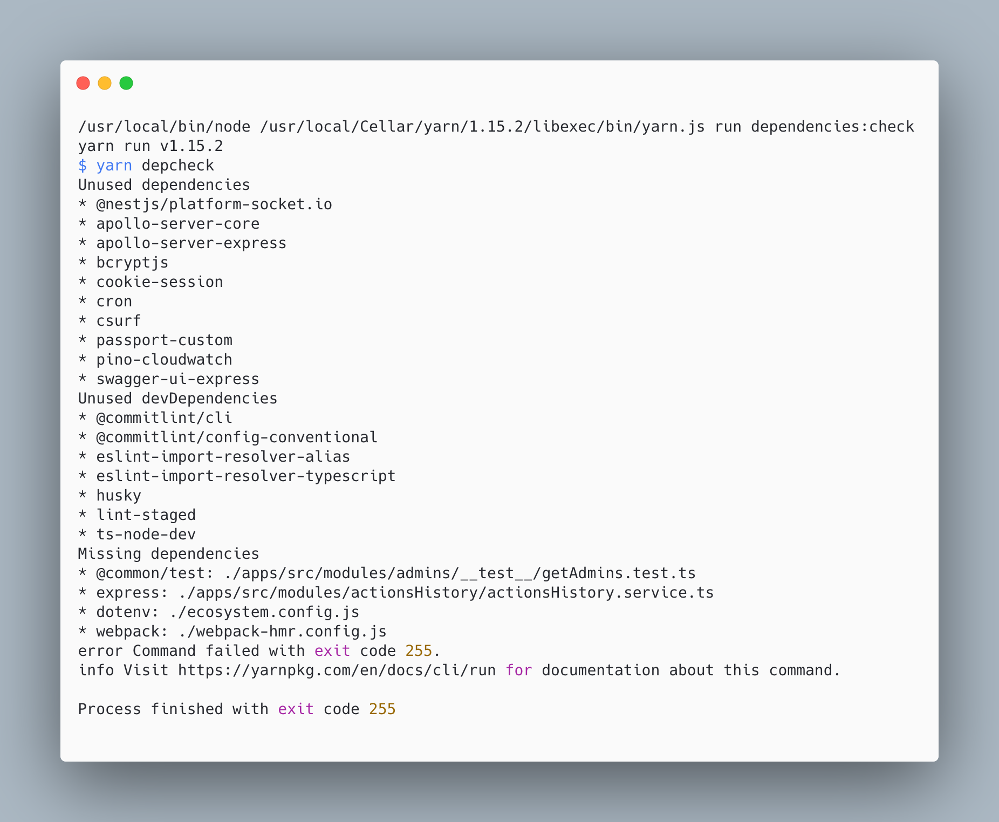
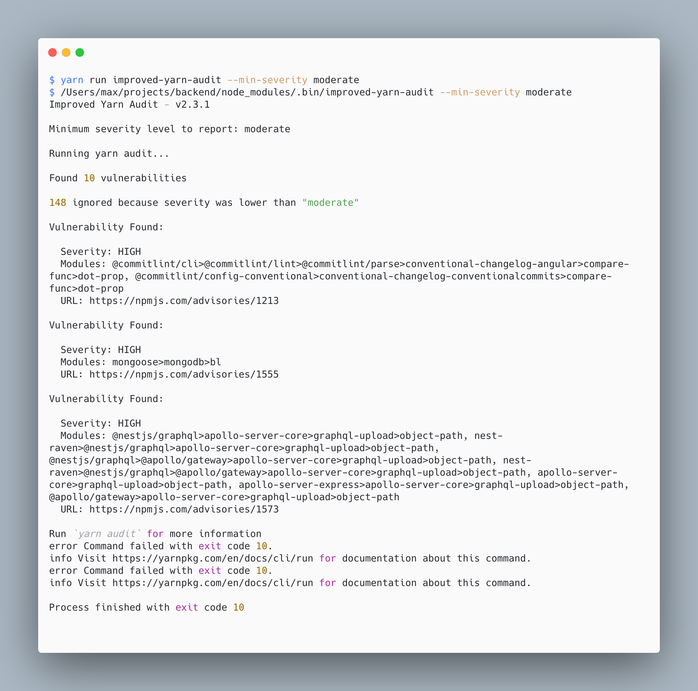
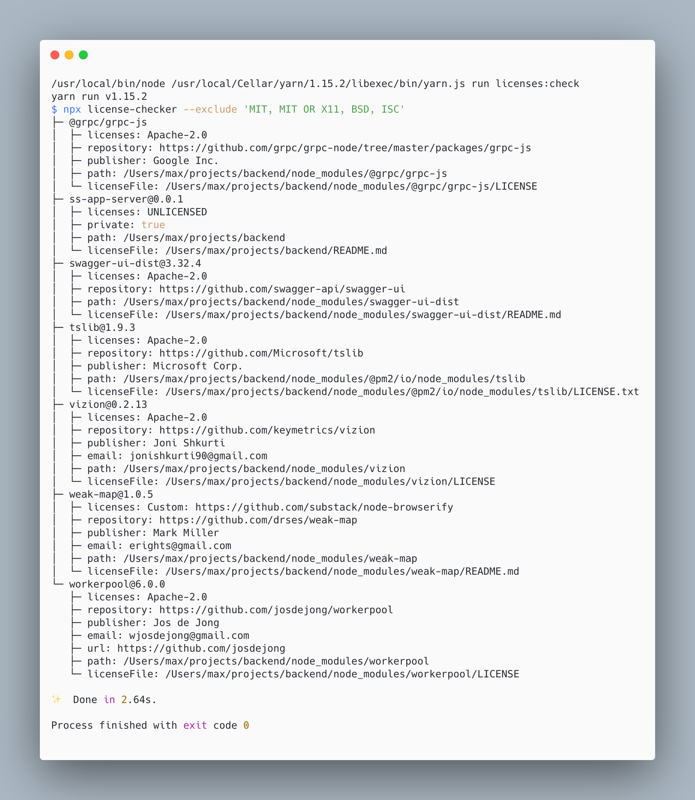
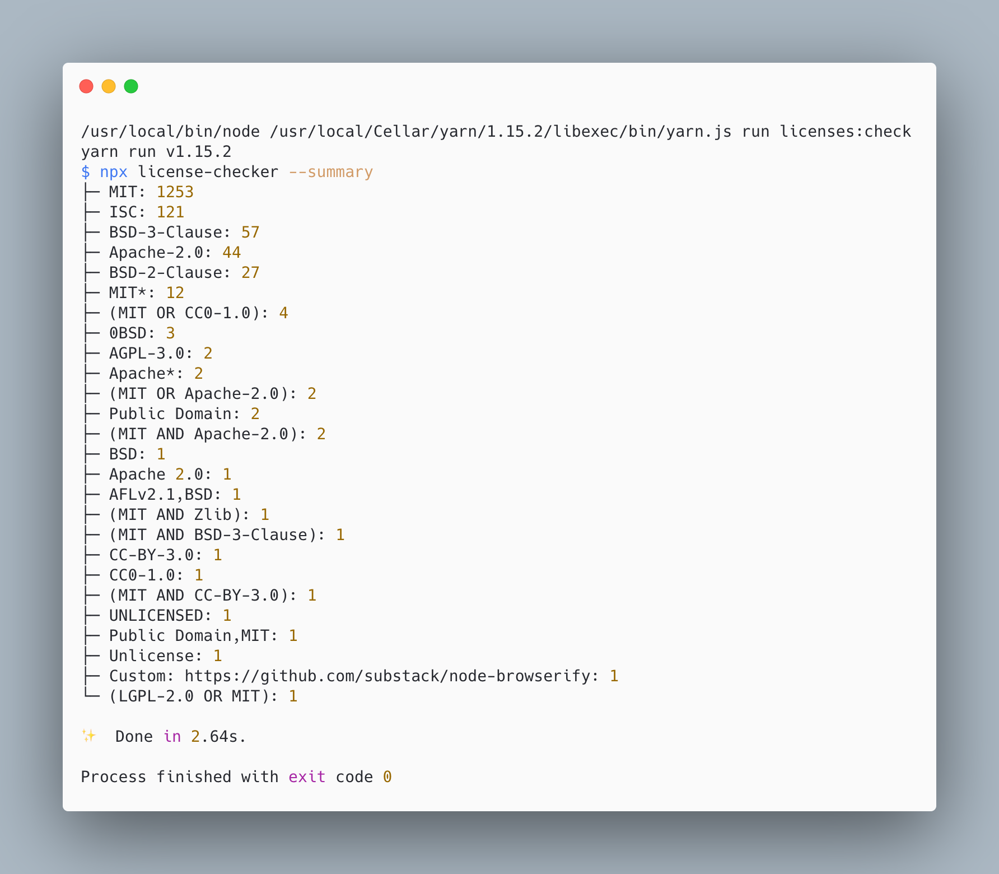

Why do we talk about project quality and technical debt so much? Because this directly or indirectly affects the speed
of development, the complexity of support, the time to implement new functionality, and the possibility of extending the current one.

There is a great number of aspects that affect a project’s quality. Some of them are difficult to understand, hard to
check, and require manual checks from highly experienced developers or QA engineers. Others are plain and simple.
They can be checked and fixed automatically. Despite this fact, they represent a weighty part of the whole project’s quality.

In this article, you will find NPM packages that can automatically check some critical sides of your project, such
as NPM dependencies, their licenses, and validating security issues.

#### **Find Missed or Unused Dependencies**

Depcheck is a useful tiny library to check what dependencies are unused and what dependencies are missing from package.json but used in your code base.

[depcheck - Check for Vulnerabilities in Your Dependencies](https://www.npmjs.com/package/depcheck)

It’s highly recommended to use it locally (for instance, on pre-commit hooks) or in remote CI to avoid the following issues:
Redundant dependencies increase build/bundle size, which leads to these consequences: Docker images become bigger,
AWS Lambda handler also has longer cold starts, and an event can surpass lambda size limits.
Missed dependencies can break your applications in totally unexpected ways in production. Moreover, they can crash
your CI/CD pipelines if they are dev dependencies.

*Installation and usage*
```
npm install -g depcheck
// or
yarn global add depcheck
```

*Example of usage*
```
// usage as npm script
"dependencies:check": "yarn run depcheck",
```

By running this command, you can see a list of issued dependencies:



#### **List of issued dependencies**

[npm-audit](https://docs.npmjs.com/cli/v6/commands/npm-audit), [yarn audit](https://classic.yarnpkg.com/en/docs/cli/audit/), and [improved-yarn-audit](https://www.npmjs.com/package/improved-yarn-audit)
are tools that can find out dependency vulnerabilities.
Moreover, they automatically update packages to resolve issues.
Both npm audit and yarn audit are pre-installed with package managers, but I prefer improved-yarn-audit.
It’s a wrapper around yarn audit that provides some improvements — especially for usage in CI pipelines (from docs):

- No way to ignore advisories
- Unable to filter out low severity issues
- Ongoing network issues with NPM registry cause false positives

[improved-yarn-audit - This project aims to improve upon the existing Yarn package manager audit functionality](https://www.npmjs.com/package/improved-yarn-audit)

*Installation*
```
npm install -g depcheck
// or
yarn global add improved-yarn-audit
```

*Example of usage*
```
"dependencies:audit": "yarn run improved-yarn-audit — min-severity moderate",
```

Below, you can see the results of using this command in a real project codebase. This tool searches for vulnerabilities
in transitive dependencies too:



#### **Check Licenses of Dependencies**

For real production projects, dependency licenses are critical to use because the way that you are using
the dependency can be prohibited by the package’s license. To avoid this, you should continuously check the
licenses of all dependencies that you use in a project. And if your project is a startup, appropriate usage of dependencies
according to their licenses is mandatory to get investors to approve your product. license-checker is the best way to do this!

[license-checker - Ever needed to see all the license info for a module and its dependencies?](https://www.npmjs.com/package/license-checker)

*Installation*
```
npm install -g license-checker
// or
yarn global add license-checker
```
*Example of usage*
```
"licenses:check": "yarn run license-checker --exclude 'MIT, MIT OR X11, BSD, ISC'",
```

Checking licenses of dependencies



But for usage inside CI/CD, I prefer the following variant because it’s much shorter:

```
"licenses:check:ci": "yarn run license-checker — summary",
```


*I hope this article helped you to address or avoid problems with NPM packages.*
*Thanks for reading!*

