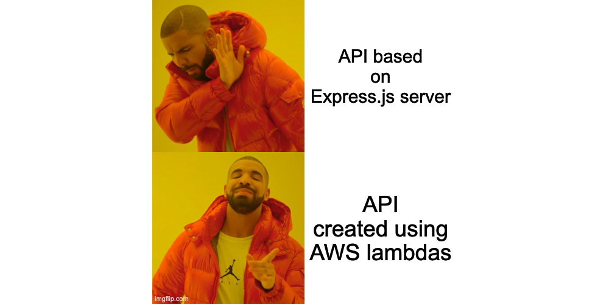
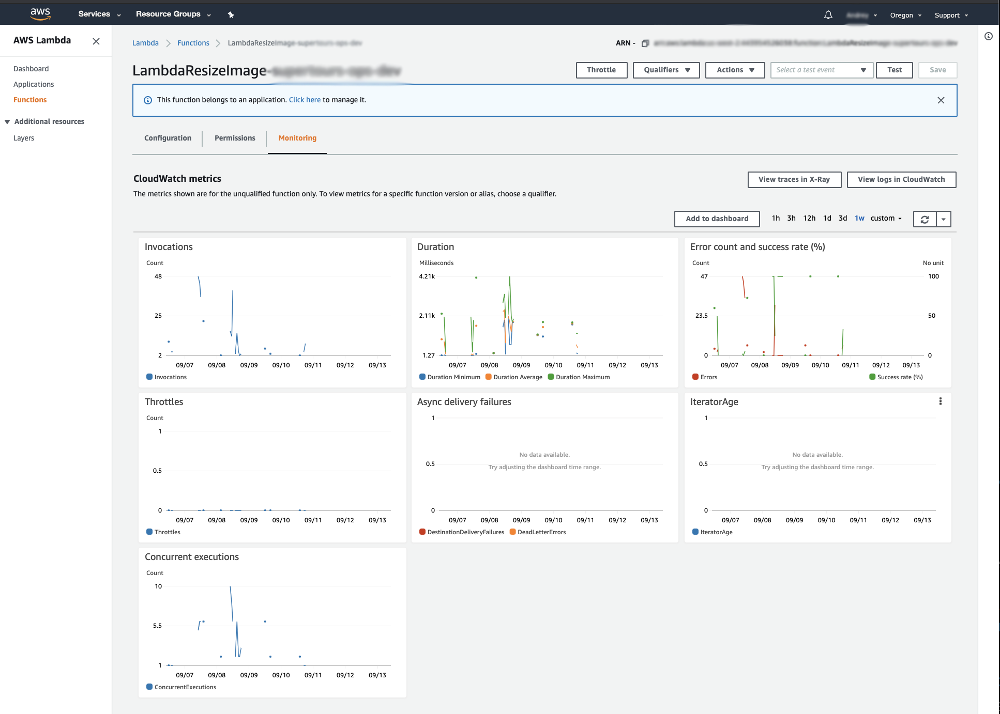
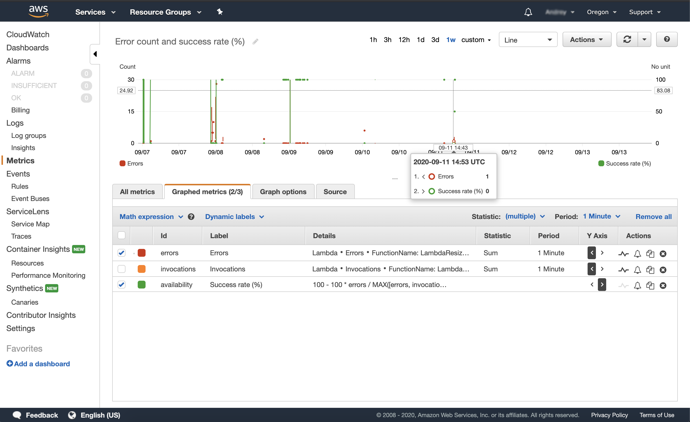

[Original on brocoders.com](https://brocoders.com/blog/what-we-have-learned-while-using-AWS-Lambdas-in-our-production-cycles/)

Over the last few years, serverless approaches have gained decent traction in the web app designing, developing and implementing sectors. In the early days, many engineers treated serverless just like another hype. Still, almost all of those who tried to use it had to admit that the technology turned out to be as good as traditional and standalone virtual machines for hosting web-applications.

To date, we can see that startups tend to utilize serverless technology stack as a part of their systems or even as their primary solution for building products in different domains.

### **First things first**
Our team decided to test out the technology while working on the product during the last year — an *on-demand bike taxi app* that uses a serverless approach for one of its components. In fact, it is much similar to an Uber app.

Technically, it was mostly a REST API and cron-tasks, anchored by the following technologies (all of these are provided by the Amazon Web Services):

* API Gateway as a platform for API management.
* CloudWatch Rules for scheduling cron-tasks.
* Lambdas as computing units.
* S3 buckets to store static files.
* CloudWatch Logs with Logs Insights for log management.
* Tools for continuous integration and deployment of our application: AWS CodeBuild, AWS CodePipeline and AWS CodeDeploy.

Initially, we used Node.js version 10 to write the code (a few months ago it was upgraded to version 12 without any issues). And all the infrastructure part (I mean all the AWS objects descriptions) is created and managed by an open-source Serverless Framework.

_*This guide is not about AWS, FaaS (Function as a Service) or Serverless framework, since there is a lot of such content on the Internet. Here you will only find the things that our team faced during the development and after-launch stages. This info might be helpful if you come up with doubts about which technology to adopt for your next project. *_

### **The Serverless world — the remarkable benefits of using AWS Lambdas**
Let's start with the good parts! No matter what any hater says, the Serverless world provides a bunch of excellent features that you cannot achieve in any other way under equal conditions.

When we started this project mostly from scratch, it didn't require any severe capacity in measurements of Memory, CPU or network, to name a few. The same statement can be made not only about the development phase but also about the Staging, QA and Pre-Prod environments.

Traditionally, we need four servers, whether that be virtual machines, docker containers or any other platforms where we can host servers. For sure, it might be quite expensive to keep and maintain servers, even small and low-power ones. Even switching them off at nights and weekends is no way an option.

However, the Serverless world has an alternative solution – the so-called "Pay as you go" payment approach. It means that you pay only for the computing resources and network load that you use, even though the entire infrastructure is deployed and accessible at any moment.

In practice, it means that we were not burdened with any cost savings during the project's development. Moreover, while we remained within the AWS Free Tier limits, the actual cloud usage was charge-free until we reached the production stage.

So here are some advantages of AWS Lambdas worth mentioning here.

### **Outstanding scalability**
The app was designed for the city with more than 13 million people. So it’s no wonder that the number of users started snowballing right after the first release. By "snowballing", I mean thousands of new users per hour in the first few weeks, hence a bunch of rides and ride requests as well.

That's where we felt all the benefits of the AWS Lambdas' _incredible scalability and zero management_ of the scaling process. You know, this feeling when you see a rapidly growing number of requests on the chart (that was automatically provided by AWS). And the greatest part is that you shouldn't even worry about this, since the AWS Lambdas are scaled automatically. All you have to do is set a threshold for the concurrent invocation.

### **A standard set of monitoring and logging tools**
Aside from the automatic scalability feature, AWS provides a basic set of tools for Lambdas. So, you don't have to waste your precious time dealing with the annoying configuration of basic monitoring metrics, such as Memory Usage, Execution time or Errors Count.

Moreover, you can customize your own dashboards in the [CloudWatch service](https://aws.amazon.com/cloudwatch/) that would help you track performance issues and execution errors throughout the entire serverless application.

For sure, you won't come up with as many customizable graphics options, as Grafana or Kibana can provide, but at the same time, the AWS CloudWatch metrics, alarms and dashboards are way cheaper. Besides, you can attune these without much preparation, and last but not least — the cloud provider takes responsibility for the efficiency of the monitoring tools described above.

### **Isolated environment**
Well, let's say you managed to customize a dashboard without any problems. But then you realized that the Lambdas execution process took more time than it should have, and it looked like Lambdas performed some sophisticated calculation. Luckily, it's not a problem for AWS Lambda, since every function-handler runs in an isolated environment, with its own configuration system of Memory or CPU.

In-fact, each instance of Lambda is a separate AWS Firecracker Container that spawns on a trigger (in case of a REST API, the trigger is an HTTP request). That said, all you have to do is just increase CPU units Count or Memory for the specific Lambda, with no need for global updates, as if it were done in a classic server.

### **Flexible errors management**
Another outstanding benefit that you can enjoy while using AWS Lambda is *decent error handling*.

As said above, each Lambda has an isolated environment, so even if one of your Lambda instances fails for any reason, all other Lambdas will continue to operate normally. It's fantastic when you have just one or two errors from a few hundred possible AWS Lambda invocations, isn't it?

### **Automated retry attempts**
Furthermore, retry attempts is another out-of-the-box feature that AWS provides. Should a Lambda fail for any reason, it would be automatically re-invoked with the same event payload during the pre-configured period. I must say, it’s a quite useful feature if your Lambda is invoked by schedule and is trying to send a request to a third party resource that can be unavailable.

Finally, AWS Lambda supports the [Dead letter queue concept](https://docs.aws.amazon.com/AWSSimpleQueueService/latest/SQSDeveloperGuide/sqs-dead-letter-queues.html) that means you can acquire relevant notifications and tracking information about failed Lambdas.

### **The AWS Lambda disadvantages — a few pain points to learn from**
On the flip side of the coin, AWS Lambda and the serverless concept are not entirely perfect yet and have enough unresolved problems and pitfalls that make the development and support processes a little bit harder.

### **Duration limits**
For our project, it was all about limits. For example, we ended up with an execution duration limit — a Lambda can be performed within 15 minutes maximum. Moreover, if a trigger is requested from an API Gateway, the duration must be no more than 30 seconds.

Perhaps, we could accept such limits for the API, but a 15-minutes limit for the cron-tasks was way too tight to execute the particular scope of tasks on time. That said, since the computed intensive tasks couldn't be invoked with Lambdas, we had to create a separate server specifically for long-running tasks.

### **CloudFormation deployment limitations**
Another significant issue we faced was the Lambda deployment via CloudFormation (the AWS service for infrastructure and deployment). At the very beginning of the project, everything was fine. Still, when the number of Lambdas mushroomed into more than 30 CloudFormations, the stack started failing with different errors like "Number of resources exceeded", "Number of outputs exceeded".

Thankfully, the serverless framework and its plugins helped us to tackle this issue early on. There are also a few other ways to solve such kinds of problems, but that'll be a topic for another article.

### **Failure to expand monitoring and debugging toolset**
Even though AWS provides some basic level of monitoring and debugging, it's still _impossible to extend this part and make some custom metrics_ that could be useful for particular cases and projects. This time around, we had to use third-party services that you usually need to integrate as libraries into your code to be able to monitor some specific stuff.

### **Cold start-related delays**
As mentioned above, each Lambda instance is in-fact a tiny Firecracker Container with some basic runtime environment, libraries and your code. It's created temporarily to process any event evoked by the triggers. It's a well-known fact that creating a container or running an executable environment and code takes some operational time called a cold start.

It can take random time between 100 milliseconds to a few minutes. Moreover, if you keep your Lambdas under VPC (Virtual Private Cloud), cold starts will take more time because the system will have to create additional resources for each Lambda, called Elastic Network Interfaces.

This, in turn, results in annoying delays, so the end-users have to wait for the app to respond, which is definitely not good at all, isn't it? The workaround here is to ping your Lambda every 5 minutes to keep containers "warm". The AWS system is smart enough and doesn't kill Lambdas containers immediately, since it is based on the concept that triggers would keep spawning new events.

### **Database connection pitfalls**
In view of the above, it's problematic to manage a database connection for such a system. You cannot just open a connection pool to your MongoDB or MySQL servers at the application startup phase and reuse it during the entire lifecycle.

So there are at least two ways to manage connections:

You should open a connection for each Lambda invocation and close it after your code with logic would be completed; You can try to reuse a connection and keep it in the Lambda memory as a reference in code or field in context — it allows you to keep a connection within the same Lambda containers till closing.

However, both have their own limitations. In the first case, we end up with additional delays since we have to open a connection for each Lambda call. In the second case, we can't be sure for how long Lambda would keep a connection, and consequently — we can't handle a connection shut-down properly.

### **Local test limitations**
Besides, the serverless apps are hard to test locally, because usually there are a lot of integrations between AWS services, like Lambdas, S3 buckets, DynamoDB, etc. For any type of local testing, developers must mock all this stuff, which usually is a formidable and time-consuming task.

### **Inability to adopt caching in a traditional way**
On top of everything else, you can't implement a traditional caching for classic-like servers. Usually, you have to use other services like S3, DynamoDB or ElasticCache (de-facto Redis hosted on AWS) to keep Lambda's state or cache some data between AWS Lambda invocations.

In most cases, it results in extra costs of the entire infrastructure. Not to mention additional operational overhead — you'll have to put and fetch cached data from remote storage, which, in turn, can slow down the performance of your cache.

### **Complex payment model**
The last one worth mentioning is a sophisticated price calculation. Even though AWS Lambda is quite cheap, various supplementary elements can significantly increase the total costs. People tend to think that the pricing for using the AWS Lambda's API is based on its computing resources and duration of code execution. In fact, you should keep in mind that you'll have to pay for additional services, such as:

* Network traffic,
* API Gateway,
* Logs stored in the CloudWatch.

### **Wrapping up**
Summarizing the above, I want to say that the AWS serverless approach is a great way to strengthen your development practices. Nevertheless, you have to keep in mind that it's quite different from traditional servers.

To leverage the life-changing benefits of this technology, you have to get acquainted with all the subtleties and pitfalls in the first place. Besides, you also have to think through the architecture and its specifics for your particular solution.

Otherwise, the serverless approach can bring you rather problems than beneficial features as of insufficient educational background.

